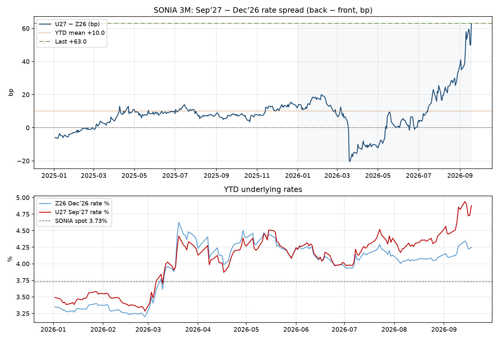

# Handoff: SONIA U27 − Z26 (Sep’27 − Dec’26)

**Purpose:** Self-contained brief for another agent to evaluate the preferred
fade-BoE-peak expression: **short U27−Z26** = receive J8U27 / pay J8Z26.

**As-of:** 2026-09-18 (settlements / Barchart EOD). Spot SONIA **3.7303%**.

---

## 1. Exact months (not ambiguous)

| Leg | ICE root | Contract code | Delivery / IMM month | Role |
|---|---|---|---|---|
| **Front** | J8 (3M SONIA) | **J8Z26** | **December 2026** | Pay (short rate / sell futures) |
| **Back** | J8 (3M SONIA) | **J8U27** | **September 2027** | Receive (long rate / buy futures) |

- **Z** = December, **U** = September (standard futures month codes).
- **26** = 2026, **27** = 2027.
- This is **not** Jun’27/Jun’28 (GS M7M8 / M28−M27), **not** Z7Z8 (Dec’27−Dec’28),
  and **not** BoE Sep’27 vs ECB Sep’27 (cross-currency).

---

## 2. Spread definition (desk convention)

Desk slope = **back − front** in **rate** space:

\[
\text{spread (bp)} = 100 \times \big(r_{\text{U27}} - r_{\text{Z26}}\big)
\]

| | |
|---|---|
| Last (2026-09-18) | **+63.0 bp** |
| Z26 rate | 4.250% |
| U27 rate | 4.880% (SONIA strip **peak** on this as-of) |
| Positive spread | Back > front → path still **steepening into the peak** |
| Short spread P&amp;L | ≈ **−Δ(spread bp)** per matched DV01 |
| Wins when | Gap **flattens** (U27 falls vs Z26, or Z26 rises more than U27) |

YTD (2026-01-02 → 2026-09-18, n=181):

| Stat | Value | Date |
|---|---:|---|
| Min | **−20.5 bp** | 2026-03-20 |
| Max | **+63.0 bp** | 2026-09-18 (= last) |
| Mean | **+10.0 bp** | — |
| Distance last → mean | **~53 bp** | right-way for short |
| Distance last → 0 | **63 bp** | right-way to flat |
| In-sample further steepening room | **0 bp** | already at YTD max |

Full daily series (2021-09-21 → 2026-09-18, n=1274):  
`data/cache/stir_curves/sonia_u27_minus_z26_timeseries.csv`

Meta JSON: `data/cache/stir_curves/sonia_u27_minus_z26_handoff_meta.json`

Related analysis note (thesis / PDF mapping):  
`research/notes/sonia_short_u27_z26_2026-09-20.md`

---

## 3. Plot

Also cached at `data/cache/stir_curves/sonia_u27_minus_z26_2026-09-18.png`.

Top panel: U27−Z26 in bp (last +63, YTD mean +10).  
Bottom panel: Z26 and U27 rates vs SONIA spot 3.73%.

---

## 4. Weekly time series (YTD, last print in each week)

| date | Z26 % | U27 % | U27−Z26 bp |
|---|---:|---:|---:|
| 2026-01-02 | 3.350 | 3.490 | 14.0 |
| 2026-01-09 | 3.275 | 3.385 | 11.0 |
| 2026-01-16 | 3.325 | 3.470 | 14.5 |
| 2026-01-23 | 3.375 | 3.560 | 18.5 |
| 2026-01-30 | 3.375 | 3.555 | 18.0 |
| 2026-02-06 | 3.285 | 3.480 | 19.5 |
| 2026-02-13 | 3.265 | 3.410 | 14.5 |
| 2026-02-20 | 3.250 | 3.375 | 12.5 |
| 2026-02-27 | 3.200 | 3.285 | 8.5 |
| 2026-03-06 | 3.615 | 3.740 | 12.5 |
| 2026-03-13 | 3.960 | 4.025 | 6.5 |
| 2026-03-20 | 4.625 | 4.420 | −20.5 |
| 2026-03-27 | 4.470 | 4.320 | −15.0 |
| 2026-04-02 | 4.270 | 4.150 | −12.0 |
| 2026-04-10 | 4.165 | 4.065 | −10.0 |
| 2026-04-17 | 3.985 | 3.870 | −11.5 |
| 2026-04-24 | 4.300 | 4.200 | −10.0 |
| 2026-05-01 | 4.390 | 4.267 | −12.3 |
| 2026-05-08 | 4.320 | 4.225 | −9.5 |
| 2026-05-15 | 4.445 | 4.510 | 6.5 |
| 2026-05-22 | 4.245 | 4.275 | 3.0 |
| 2026-05-29 | 4.080 | 4.085 | 0.5 |
| 2026-06-05 | 4.225 | 4.270 | 4.5 |
| 2026-06-12 | 4.130 | 4.160 | 3.0 |
| 2026-06-19 | 4.110 | 4.175 | 6.5 |
| 2026-06-26 | 3.975 | 3.975 | 0.0 |
| 2026-07-03 | 3.935 | 3.980 | 4.5 |
| 2026-07-10 | 4.055 | 4.130 | 7.5 |
| 2026-07-17 | 4.165 | 4.300 | 13.5 |
| 2026-07-24 | 4.225 | 4.440 | 21.5 |
| 2026-07-31 | 4.130 | 4.385 | 25.5 |
| 2026-08-07 | 4.035 | 4.230 | 19.5 |
| 2026-08-14 | 4.055 | 4.305 | 25.0 |
| 2026-08-21 | 4.070 | 4.340 | 27.0 |
| 2026-08-28 | 4.095 | 4.415 | 32.0 |
| 2026-09-04 | 4.095 | 4.450 | 35.5 |
| 2026-09-11 | 4.285 | 4.820 | 53.5 |
| 2026-09-18 | 4.250 | 4.880 | 63.0 |

Path summary: early-YTD ~+10–20 → March inversion to **−20.5** → mid-year near
flat → July–Sep steepening **+4.5 → +63**.

---

## 5. Last 30 sessions (daily)

| date | Z26 % | U27 % | U27−Z26 bp |
|---|---:|---:|---:|
| 2026-08-07 | 4.035 | 4.230 | 19.5 |
| 2026-08-10 | 4.065 | 4.310 | 24.5 |
| 2026-08-11 | 4.040 | 4.265 | 22.5 |
| 2026-08-12 | 4.060 | 4.285 | 22.5 |
| 2026-08-13 | 4.050 | 4.260 | 21.0 |
| 2026-08-14 | 4.055 | 4.305 | 25.0 |
| 2026-08-17 | 4.075 | 4.330 | 25.5 |
| 2026-08-18 | 4.085 | 4.360 | 27.5 |
| 2026-08-19 | 4.070 | 4.355 | 28.5 |
| 2026-08-20 | 4.075 | 4.360 | 28.5 |
| 2026-08-21 | 4.070 | 4.340 | 27.0 |
| 2026-08-24 | 4.085 | 4.385 | 30.0 |
| 2026-08-25 | 4.050 | 4.305 | 25.5 |
| 2026-08-26 | 4.050 | 4.320 | 27.0 |
| 2026-08-27 | 4.055 | 4.335 | 28.0 |
| 2026-08-28 | 4.095 | 4.415 | 32.0 |
| 2026-09-01 | 4.140 | 4.520 | 38.0 |
| 2026-09-02 | 4.155 | 4.565 | 41.0 |
| 2026-09-03 | 4.105 | 4.455 | 35.0 |
| 2026-09-04 | 4.095 | 4.450 | 35.5 |
| 2026-09-07 | 4.120 | 4.495 | 37.5 |
| 2026-09-08 | 4.120 | 4.510 | 39.0 |
| 2026-09-09 | 4.160 | 4.625 | 46.5 |
| 2026-09-10 | 4.275 | 4.855 | 58.0 |
| 2026-09-11 | 4.285 | 4.820 | 53.5 |
| 2026-09-14 | 4.345 | 4.940 | 59.5 |
| 2026-09-15 | 4.310 | 4.895 | 58.5 |
| 2026-09-16 | 4.225 | 4.725 | 50.0 |
| 2026-09-17 | 4.230 | 4.730 | 50.0 |
| 2026-09-18 | 4.250 | 4.880 | 63.0 |

Short from ~19-Aug (+28.5) → 18-Sep (+63) would have lost **~34.5 bp**.

---

## 6. Empirical regimes (rally / selloff / has it flattened?)

Full write-up: `research/notes/sonia_u27_z26_empirical_regimes_2026-09-20.md`  
Figure: `research/notes/figures/sonia_u27_z26_rally_selloff_2026-09-18.png`

| Question | Answer from the CSV |
|---|---|
| Ever flattened? | **Yes** — 640/1274 days spread &lt; 0; YTD trough **−20.5** (20-Mar); Nov’25→Mar’26 drop **33 bp** |
| Selloff (ΔZ26 &gt; +0.5)? | YTD mean Δspread **+1.13**; since Aug **+3.53** → **steepens** |
| Rally (ΔZ26 &lt; −0.5)? | YTD mean Δspread **−0.67**; since Aug **−2.71** → **flattens** |
| Full 2021–26? | ~**no edge** (selloff −0.02 / rally +0.10) |
| March flatten driver | Selloff with **β&lt;1** (Z26 became the peak) — opposite of Aug β≈2 |

## 7. Thesis snapshot (for the evaluating agent)

**Idea:** Fade the SONIA strip peak (Sep’27) vs Dec’26 — i.e. bet the hike
path into U27 stops extending / mean-reverts.

**Why this gap (vs rejected alternatives):**

| Alternative | Why not preferred |
|---|---|
| Short Z7Z8 (Z28−Z27) | Already run / at floor; flattener already priced |
| Long BoE Sep’27 vs short ECB Sep’27 | Cross-currency / late relative to strip fade |
| GS M7M8 (M28−M27) | Different gap; already ~flat/inverted; Nov-hike narrative maps poorly here |

**Mechanism caveat:** Since Aug, β(ΔU27 | ΔZ26) ≈ **2.0**. On Z26 selloff
days the spread has **steepened**, not flattened. Short is a bet that
outrunning **stops**, not that “front sells → automatic flatten.”

**PDF alignment:** Closer to “market peak 4.88 vs Bank Rate hold ~3.75”
(Barclays Econ Weekly base) than to GS’s stated M7M8 trade.

**Main risk:** Another energy/CB shock with β≈2: Z26 +10 bp → U27 +20 →
short loses ~10 bp.

**Implementation:** recv **J8U27** / pay **J8Z26**, 1:1 DV01.  
Optional cousin: short M27−Z26 (+57, also at YTD max).  
Optional cross: short SONIA U27−Z26 vs long Euribor U27−Z26 (GBP−EUR ~+9.5 near max).

---

## 8. Data provenance

- Futures: Barchart core-api EOD on fixed contracts `J8Z26`, `J8U27`
  (see `memory/book.md` data plan).
- Spot SONIA: FRED / local cache as used in curve snapshot asof 2026-09-18.
- Levels above are from files under `data/cache/stir_curves/`, not model memory.
- Do **not** invent missing history; if the CSV gap or refresh is needed,
  re-fetch via `scripts/fetch_barchart_stir.py`.

---

## 9. Suggested evaluation checklist for the other agent

1. Confirm months: **Dec’26 vs Sep’27** (Z26 / U27), desk = back − front.
2. Recompute last spread from CSV / raw settles; match **+63.0**.
3. Stress: +10 bp parallel on Z26 with β=1 vs β=2 on U27 — P&amp;L of short.
4. Compare carry/roll of 1:1 DV01 vs alternatives (M27−Z26, fly through peak).
5. Separately: is “fade peak” better expressed as **receive U27 outright**
   vs **short U27−Z26** given Z26 may still sell off with hikes?
6. Do not treat GS M7M8 or Z7Z8 as the same trade.
